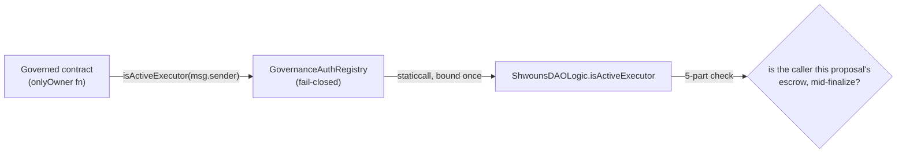

# Architecture: Authorization & trust model

The auditor-facing reference for *who can call what, and why nothing else can*. Read with
[flows/escrow-execution.md](../flows/escrow-execution.md) (the executor-authentication mechanics) and
[flows/deployment.md](../flows/deployment.md) (the no-EOA handoff).

## Principals

| Principal | What it is | What it can do |
|---|---|---|
| **Vault owner** | Current holder of a Shwoun (+ any address granted via `Permissioned`) | Deposit/withdraw the vault's assets; execute arbitrary calls from the vault. Sovereign — cannot be frozen or overridden. |
| **DAOLogic** | The governance proxy | The ONLY caller of `vault.pullProRata`. Drives every `ProposalEscrow`. Its own admin post-handoff. |
| **Active proposal escrow** | The per-proposal clone, *only during its `finalize`* | Acts as the owner of every DAO-owned contract — but only while it is the authenticated active executor. |
| **Vetoer** | An emergency-brake role (renounceable) | `veto` a proposal. Nothing else. Can burn its own power. |
| **Bootstrap operator** | The deploying EOA, pre-finalize only | Drive deploy/execute/registerManifest/finalize. Loses all power at `finalizeBootstrap`. |
| **Anyone** | — | Bid; vote (if a holder); drive the paged lifecycle ops (queue/snapshot/collect/finalize/refund); mint a GI NFT; claim earned rewards. |

There is **no standing EOA admin or owner** after deployment. Privileged functions are reachable only
through governance.

## The executor-authentication chain

DAO-owned contracts need to let an approved governance action manage them, without giving any standing
address that power. The chain:

1. **`GovernedOwnable`** — the base for the six non-upgradeable governed contracts (token, descriptor,
   vault registry, rewards, GI NFT, approval registry). Its `_checkOwner` accepts the structural owner
   OR an address the auth registry confirms is the active executor. It adds **no storage slot** (the
   registry reference is `immutable`, living in bytecode). `transferOwnership` is constrained
   post-binding: ownership may move only to the DAO or to `address(0)`, never an EOA. The upgradeable
   `ShwounsAuctionHouse` applies the same rule inline against `OwnableUpgradeable`.
2. **`GovernanceAuthRegistry`** — a tiny indirection that lets governed contracts take an `immutable`
   auth reference at *construction*, before the DAOLogic proxy exists. The Bootstrap coordinator
   deploys it first (becoming its immutable `binder`), every governed contract references it, and it
   is `bindDAOLogic`-ed to the proxy exactly once afterward. It is **fail-closed**: while unbound it
   returns false; once bound, a revert / short / malformed / non-`true` return all resolve to false.
   Only a canonical boolean `true` authorizes. No re-bind, no setter.
3. **`ShwounsDAOLogic.isActiveExecutor`** — the source of truth. Returns true only if all five hold:
   execution is in progress (`executing`); there is an active proposal (`activeProposalId != 0`); it
   is in the transient `Executing` state; the candidate equals that proposal's deterministic escrow
   address; and the candidate's codehash is the expected EIP-1167 clone codehash. It never trusts a
   caller-supplied id, escrow storage, `tx.origin`, or the escrow's self-report.

The net effect: a DAO-owned `onlyOwner` function is callable **only** by the escrow of the proposal
that is *right now* executing — i.e. only by an approved governance action, within its own finalize
frame. Stale, forged, or cross-proposal callers all fail.

## Key invariants (the trust boundaries)

- **`vault.pullProRata` is callable ONLY by the registered DAOLogic** (looked up via
  `vaultRegistry.daoLogic()`, locked at deployment). Nothing else can move a vault's funds without
  the owner.
- **The vault implementation is non-upgradeable** and pinned in `VaultRegistry.vaultImplementation`
  (locked). The Tokenbound upgrade vector is closed.
- **Vaults never use `Overridable`** — the holder cannot override any selector (including
  `pullProRata`). See [relationships.md#forked-tokenbound-erc-6551](relationships.md#forked-tokenbound-erc-6551-group-d--do-not-edit-security-relevant-diff).
- **No timelock; funds flow snapshot→collect→finalize from a per-proposal escrow.** Cross-proposal
  fund-drain and reentrancy are unreachable by construction (see
  [escrow-execution.md](../flows/escrow-execution.md)).
- **`finalize` is retryable** — if a target reverts, funds stay in the escrow and finalize can be
  re-run after conditions change; stuck funds unwind via `refundStuckProposal`.
- **GI NFT eligibility is tokenId-keyed, not address-keyed.** Approval follows the NFT on transfer —
  intentional: the DAO approves a specific, auditable identity-bound asset.
- **UUPS upgrades (DAOLogic, auction house) require `isActiveExecutor`** — never a standing
  admin/EOA. A DAOLogic self-upgrade must be a proposal's final action.
- **Reserved reward funds are never sweepable.** `GovernanceRewards` separates reserved pools from
  unreserved balance; sweeps/gas-refunds touch only unreserved balance (M-01).

## The no-EOA handoff

`Bootstrap` is `msg.sender` in every constructor, so it transiently owns/admins everything — no EOA
ever holds a role. The deploying EOA is only the `operator` that drives Bootstrap. `finalizeBootstrap`
validates the **complete** wiring against a stored manifest (ownership + every one-shot lock + the
operational wiring + the immutable/constructor matrix), then atomically binds the registry, unpauses
the auction, transfers every `Ownable` to the DAO, and sets the DAO as its own admin — reverting
(changing nothing) if any precheck fails, so a mis-wire can never be handed off. After finalize,
Bootstrap is permanently disabled. Full sequence: [deployment.md](../flows/deployment.md).

## Out of scope / residual trust

- **The art-load operator step** trusts the operator to load correct art before `lockParts`; once
  locked, art is immutable. The honest-upgrade safeguard (a UUPS candidate must report the canonical
  auth registry) defends against a storage-layout-only diff but not a fully malicious signed
  implementation — that is the A9 trust boundary, called out in `ShwounsAuctionHouse._authorizeUpgrade`.
- **Vault owners can grief their own proposals' funding** by withdrawing between snapshot and collect.
  This is by design (sovereignty); the shortfall is logged and execution is all-or-nothing.
- The protocol is **not externally audited and not deployed.** See the root
  [README](../../README.md#safety-notes) safety notes and `AUDIT_REPORT.md` / `REMEDIATION_PLAN.md` /
  `ARCHITECTURE_REVIEW_A.md` for the internal-review finding history.
