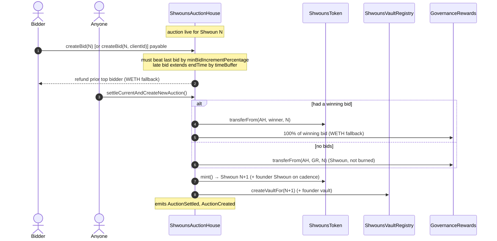
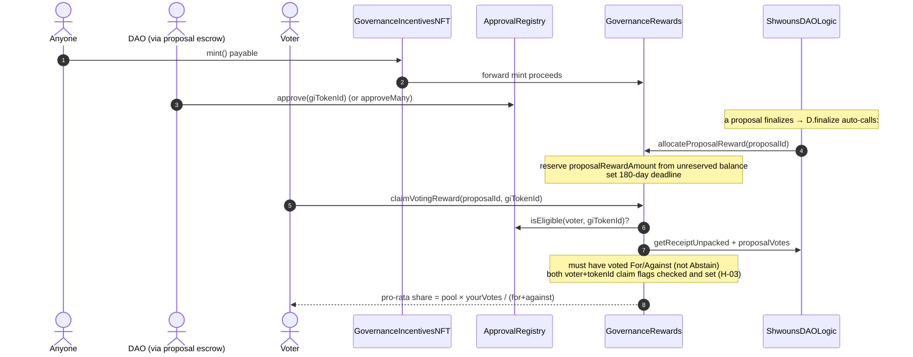

# Flow: Auction → proceeds → voter rewards

How a Shwoun is minted and auctioned, how 100% of proceeds fund the rewards accumulator, and how
voters claim incentives. Reference pages: `ShwounsAuctionHouse`, `GovernanceRewards`,
`GovernanceIncentivesNFT`, `ApprovalRegistry` in the [generated docs](../reference/SUMMARY.md).

## Auction + settlement

A new Shwoun is minted and auctioned each `duration` (24h). On settle, the Shwoun goes to the winner
(or to `GovernanceRewards` if there were no bids — it is **not** burned), and **100% of the winning
bid goes to `GovernanceRewards`**. There is no treasury cut. Every minted Shwoun (auction winner and
founder reward) gets its ERC-6551 vault deployed via the registry.

Notes:
- **Founder cadence.** Every 10th Shwoun (ids 0, 10, 20, …) goes to the founders DAO, for the first
  1820 ids — mirroring Nouns. The auction house deploys the founder Shwoun's vault too.
- **Sanctions.** If a `sanctionsOracle` is configured, bids from sanctioned addresses revert.
- **Settlement history.** Per-Shwoun settlement data (price, winner, client id) is stored for
  off-chain analytics (`getSettlements`, `getPrices`, `biddingClient`).
- **Upgradeable.** The auction house is a UUPS proxy; upgrades flow only through an authenticated
  proposal escrow (see [escrow-execution.md](escrow-execution.md)).

## Where the money is

`GovernanceRewards` is the single accumulator. Inflows: auction proceeds, GI NFT mint proceeds, and
direct deposits. Outflows: per-proposal voter reward pools (lazy, per claim) and capped gas refunds.
Its accounting separates **reserved** funds (allocated reward pools that must stay claimable) from
**unreserved** balance (everything else) — gas refunds and owner sweeps may only touch unreserved
balance (M-01).

## Voter incentives: the two-stage gate

Earning a voter reward requires both halves of an anti-sybil gate (details in
[voter-incentives.md](../concepts/voter-incentives.md)):

1. **Mint** a `GovernanceIncentivesNFT` — open, permissionless, costs `mintPrice` (0.01 ETH default);
   proceeds flow to `GovernanceRewards`.
2. The DAO **approves** that specific token id in `ApprovalRegistry` (via a governance proposal).
   Approval is keyed by **token id, not holder** — it follows the NFT on transfer.

### Reward accounting rules

- The pool is split **pro-rata by voting weight** among For + Against voters (Abstain earns nothing).
- A voter can claim **once** per proposal (`voterClaimed`), and each approved GI token id can claim
  **once** per proposal (`claimedByTokenId`, H-03) — so an approved NFT passed hand-to-hand cannot
  authorize many voters.
- Claims have a **180-day deadline**. After it, anyone can call `releaseExpiredRewardRemainder` to
  return the unclaimed remainder to unreserved balance (pro-rata pools are rarely fully claimed).
- Allocation never over-commits: `allocateProposalReward` reserves against *unreserved* balance, so
  the sum of live pools can never exceed the contract's ETH.

### Gas refunds

`castRefundableVote` records the vote and then asks `GovernanceRewards.refundGas` to reimburse the
voter, capped at `maxRefundPerVote` and drawn only from unreserved balance. It never reverts the vote
if the refund can't be paid.

## Events to index

Auction: `AuctionCreated`, `AuctionBid` (+ `AuctionBidWithClientId`), `AuctionExtended`,
`AuctionSettled` (+ `AuctionSettledWithClientId`). Rewards: `Deposited`, `ProposalRewardAllocated`,
`VoterRewardClaimed`, `GasRefunded`, `RewardRemainderReleased`. GI/approval: `Minted`,
`TokenIdApproved` / `TokenIdRevoked`.
