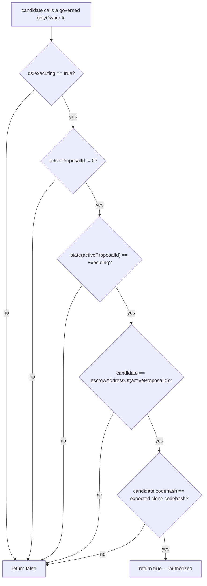
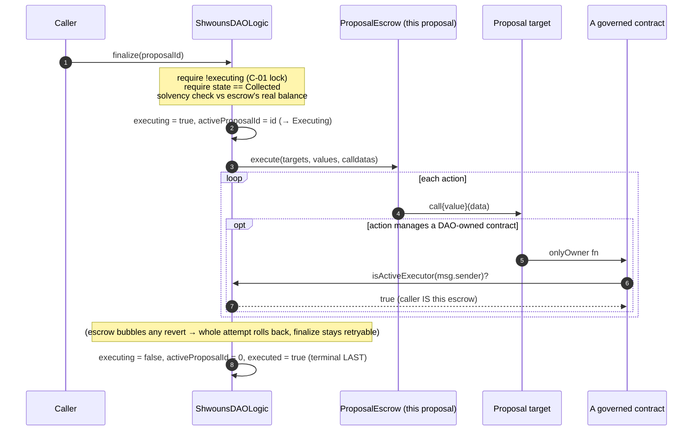

# Flow: Per-proposal escrow + executor authentication

This is the security-critical heart of Shwouns and the answer to "how do you execute proposals
without a treasury or a timelock, safely?" It is also the fix for the two critical findings (C-01
reentrant double-spend, C-02 cross-proposal allowance drain) from the internal audits. Read this
alongside [auth-and-trust.md](../architecture/auth-and-trust.md).

## The problem

A passed proposal collects funds and then makes arbitrary `target.call{value}(data)` actions. If all
proposals executed from one shared wallet (the naive design), then:

- a recipient could **re-enter** `finalize` and spend the shared balance twice (C-01); and
- an `approve(spender, x)` action by one proposal would grant the spender authority over the *shared*
  balance, reachable by any later proposal (C-02).

Bookkeeping in a shared wallet can paper over this, but it is not *enforceable* isolation.

## The fix: one single-use escrow per proposal

Every proposal — value-bearing **or** pure-governance — gets its own
[`ProposalEscrow`](../reference/SUMMARY.md): a deterministic EIP-1167 minimal-proxy clone of one
locked implementation, deployed at `queue` with `CREATE2 salt = proposalId`. Collected funds land in
that escrow, and **all** of the proposal's actions execute *from* that escrow's unique identity. A
lingering approval or a stray output asset is therefore reachable only by the proposal that produced
it. Isolation is structural, not bookkept.

Properties the security model relies on:

- **All clones share one runtime codehash** (EIP-1167 clones embed only the impl address). This is
  what lets DAOLogic authenticate an escrow by codehash. Per-instance constructor immutables would
  each have a distinct codehash and break the check — so the escrow stores *nothing* per-proposal and
  takes no constructor args.
- **There is deliberately no `initialize()`.** An initializer on a deterministic clone address would
  be a front-running/takeover surface. The escrow never learns its own `proposalId`; its identity is
  established *by DAOLogic* from the CREATE2 address.
- **The escrow is a dumb executor.** Every entry point requires `msg.sender == daoLogic` (the
  upgrade-stable proxy address). DAOLogic is the sole driver of execution, refunds (`payOut`), and
  residual recovery (`sweep*ToSink`).

## Authentication: `isActiveExecutor`

Governed contracts (the auction house, token, registries, rewards — see
[auth-and-trust.md](../architecture/auth-and-trust.md)) must let an approved governance action manage
them, but *only* while that action is genuinely executing. They don't trust the caller directly; they
ask DAOLogic, through the fail-closed [`GovernanceAuthRegistry`](../reference/SUMMARY.md), whether the
caller `isActiveExecutor`. DAOLogic answers **true only if all five hold**:

It never trusts a caller-supplied `proposalId`, the escrow's storage, `tx.origin`, or the escrow's
self-report. The deterministic address + the clone codehash together mean only a genuine escrow at
the predicted address for the *currently-executing* proposal passes.

## Finalize, step by step

The ordering is **CEI with the lock as the effect**: the execution lock + `activeProposalId` are set
*before* the external calls; the terminal `executed` flag is set *only after* `execute` returns.
Setting `executed` early would let a reentrant `rescueFromEscrow` pass its terminal gate
mid-execution — so it is set last, on purpose.

## What value movements are possible from an escrow

| Path | Driver | Destination | Notes |
|---|---|---|---|
| `execute` | DAOLogic (finalize) | proposal targets | Arbitrary `call{value}(data)`; the proposal's actions. |
| `payOut` | DAOLogic (refund) | the contributing **vault** | Plain constrained transfer; recipient derived from the registry, never caller-supplied. |
| `sweepETHToSink` / `sweepERC20ToSink` / `sweepERC721ToSink` / `sweepERC1155ToSink` | DAOLogic (`rescueFromEscrow`, terminal-gated) | the immutable `residualSink` (GovernanceRewards) | Typed transfer to the escrow's own immutable; never a caller-supplied recipient. |

Outside `execute`, value can only leave an escrow via these constrained, DAOLogic-driven paths — none
of which makes an arbitrary call or touches executor authentication.

## Why a DAOLogic self-upgrade must be the last action

UUPS upgrades of DAOLogic and the auction house are authorized *only* through `isActiveExecutor` (no
standing admin/EOA can upgrade). To keep the "the old finalize frame still authenticates" and "no
later action runs under a possibly-incompatible new implementation" invariants intact, `queue`
rejects any proposal whose DAOLogic self-upgrade (`upgradeTo`/`upgradeToAndCall`) is not the final
action (`UpgradeMustBeLastAction`).
