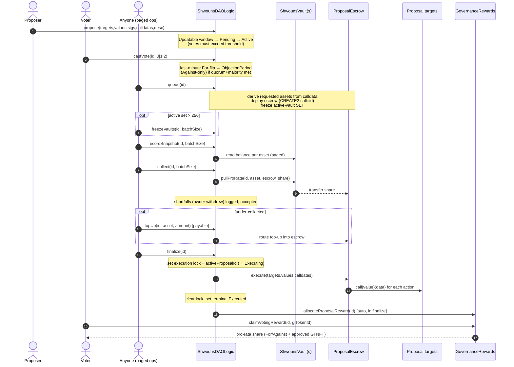
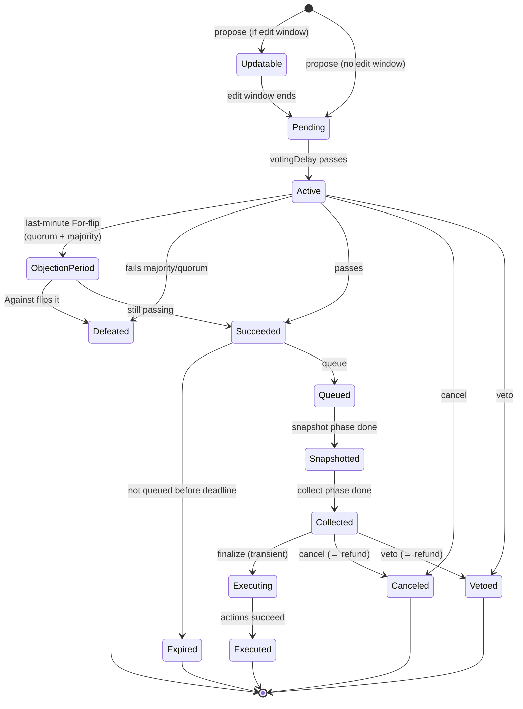

# Flow: Governance lifecycle

The full path of a Shwouns proposal, from creation to voter reward claims. This is the protocol's
defining flow — where the no-treasury model shows up. For the per-function reference see the
[generated docs](../reference/SUMMARY.md) for `ShwounsDAOLogic` and `ShwounsDAOProposals`; for the
escrow/authentication internals see [escrow-execution.md](escrow-execution.md).

All entry points are on the `ShwounsDAOLogic` facade, which `delegatecall`s into the
`ShwounsDAOProposals` / `ShwounsDAOSignatures` / `ShwounsDAOQuorum` libraries against one shared
storage struct.

## Sequence

## Phases

| Step | Function | Who | Notes |
|---|---|---|---|
| Propose | `propose` / `proposeBySigs` | Holder above threshold | Opens an Updatable edit window (if configured), then voting. Emits `ProposalCreated`. |
| Edit | `updateProposal*` | Proposer (Updatable only) | Edit actions/description before voting. Co-signed proposals use `updateProposalBySigs`. |
| Vote | `castVote` / `…WithReason` / `…BySig` / `castRefundableVote` | Any holder | 0=Against, 1=For, 2=Abstain. Emits `VoteCast`. Refundable variants route gas through GR. |
| Queue | `queue` | Anyone (once Succeeded) | Derives requested assets from calldata, validates any self-upgrade is the last action, **deploys the escrow**, freezes the active-vault set. Emits `ProposalQueued`. |
| Freeze (paged) | `freezeVaults` | Anyone | Only if the active set exceeds the 256-vault batch frozen inside `queue`. |
| Snapshot (paged) | `recordSnapshot` | Anyone | Records each frozen vault's per-asset balance. Emits `VaultSnapshotted`, then `ProposalSnapshotted` per asset on completion. |
| Collect (paged) | `collect` | Anyone | `pullProRata` each vault's share into the escrow. Emits `AssetCollectedFromVault` / `ShortfallRecorded`, then `ProposalCollected`. |
| Top up | `topUp` (payable) | Anyone | Optional: cover a shortfall so the proposal can finalize. Capped at the outstanding amount. |
| Finalize | `finalize` | Anyone | Solvency-checks, then the **escrow executes all actions**. Retryable if a target reverts. Emits `ProposalExecuted`, then auto-calls `GR.allocateProposalReward`. |
| Claim reward | `GR.claimVotingReward` | For/Against voters | Pro-rata share of the proposal's reward pool; requires an approved GI NFT. 180-day deadline. |

### Funding semantics (read this)

- The **set** of vaults is frozen at `queue`; each vault's **balance** is sampled when its page is
  processed in `recordSnapshot`/`collect`. This is *not* a historical balance checkpoint — a
  withdrawal before a vault's page is collected legitimately reduces the proposal's funding.
- `collect` pulls each vault's **pro-rata share of the requested amount** (ceiling-rounded, then
  capped so the total lands exactly on the requested amount). Each vault contributes in proportion to
  its snapshot balance.
- `finalize` is **all-or-nothing**: it reverts (`InsufficientCollected`) unless the escrow holds at
  least the requested amount of every asset. Top up the shortfall, or unwind the whole proposal via
  the refund path.

### Dead and stuck proposals

- A funded **Canceled** or **Vetoed** proposal returns each vault's *actual* contribution to *that
  vault* via the permissionless paged `refund(id, batchSize)`.
- A **Collected** proposal whose `finalize` can never succeed is unwound by the admin (i.e.
  governance) via `refundStuckProposal(id, batchSize)`.
- Stray residual assets in a *terminal* proposal's escrow are swept to `GovernanceRewards` via the
  permissionless, strictly-terminal-gated `rescueFromEscrow`.

## Proposal state machine

`state(proposalId)` is computed (not stored) and returns one of 14 states. The transient `Executing`
state has the highest precedence — it is observed *during* `finalize`, before the terminal `Executed`
flag is set, which is what makes a reentrant rescue/cancel/veto fail its gate mid-execution.

> The enum order (0=Pending … 13=Executing) is fixed and append-only — `Updatable` (12) and
> `Executing` (13) were appended after the base states and must never be renumbered (indexers and the
> storage gate depend on it). See [storage-layout.md](../architecture/storage-layout.md).

## Dynamic quorum

Quorum is not fixed: it rises with the proportion of Against votes, between a configured min and max
BPS of total supply (`minQuorumVotesBPS + coefficient × againstBPS`, clamped to `maxQuorumVotesBPS`).
Params are checkpointed (`ShwounsDAOQuorum`) so a proposal uses the params in effect at its creation
block; the first checkpoint is seeded at `initialize`, so dynamic quorum is live from block 0. A
proposal created before any checkpoint falls back to the fixed `quorumVotesBPS` recorded at creation.

## Events to index

`ProposalCreated`, `VoteCast`, `ProposalQueued`, `VaultSnapshotted`, `ProposalSnapshotted`,
`AssetCollectedFromVault`, `ShortfallRecorded`, `ProposalCollected`, `ProposalToppedUp`,
`ProposalExecuted`, `ProposalObjectionPeriodSet`, `ProposalCanceled`, `ProposalVetoed`,
`StuckProposalRefunded` / `ProposalRefundProgress` / `ProposalRefunded`, `EscrowResidualRescued`,
and (on `GovernanceRewards`) `ProposalRewardAllocated` / `VoterRewardClaimed`. Field-level definitions
are on each event's [reference page](../reference/SUMMARY.md).
