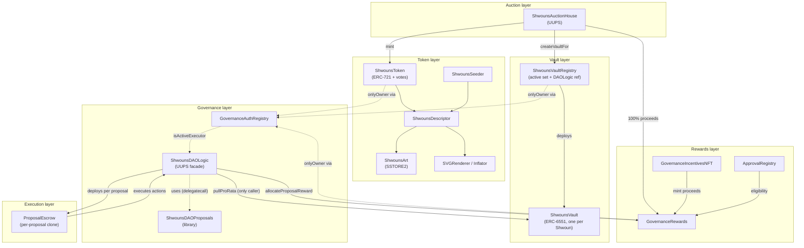

# Shwouns Protocol Overview

> Start here. This page explains what Shwouns is, how its contracts are organized into layers,
> and the one mechanic that makes it different from mainline Nouns. Integrators and auditors can
> then jump to the [reading paths](README.md) for the function reference, flow diagrams, and the
> trust model.

Shwouns is a Nouns DAO fork with one fundamental change: **there is no central treasury.** Capital
lives in a per-Noun smart-contract vault that the holder controls; governance *pulls* the funds a
passed proposal needs from those vaults at execution time. Holding a Shwoun makes you a voter;
funding your vault is a separate, opt-in act.

If you already know Nouns, the deltas are: no treasury, no timelock, no fork mechanism, no client
incentives, no glasses trait. Everything else — the daily auction, the Compound-style governance
lifecycle (dynamic quorum, objection period, signed proposals, candidates), and the fully on-chain
CC0 art stack — is preserved.

## The capital model, inverted

| | Mainline Nouns | Shwouns |
|---|---|---|
| Where capital lives | One treasury timelock | Per-Noun ERC-6551 [vaults](concepts/no-treasury-vaults.md), holder-controlled |
| How a proposal spends | Timelock executes against the treasury | Snapshot → **collect pro-rata from vaults** → execute from a per-proposal escrow |
| Auction proceeds | → Treasury | → `GovernanceRewards` (funds [voter incentives](concepts/voter-incentives.md)) |
| Voter incentives | Client incentives | Governance Incentives NFT + DAO allowlist |

The philosophical claim: **governance authority and financial commitment shouldn't be the same
thing.** A proposal can request more than will ultimately be available — vault owners are sovereign
and may withdraw at any time, including between a proposal's snapshot and its collection. Execution
is all-or-nothing against what was actually collected; a shortfall blocks execution (top it up, or
unwind via refund) rather than executing under-funded.

## The layers

Production contracts group into six layers plus a deployment coordinator. Each contract has a full
[generated reference page](reference/SUMMARY.md); the architecture of who-owns/calls/references-whom
is detailed in [architecture/relationships.md](architecture/relationships.md).



*Solid arrows are calls/value flow; dashed arrows are authorization/reference. Purple nodes are
forked Nouns art contracts; the rest is original Shwouns work.*

- **[Token layer](reference/SUMMARY.md)** — `ShwounsToken` (ERC-721 with Compound-style vote
  checkpoints), `ShwounsSeeder` (4-trait seed, no glasses), `ShwounsDescriptor` + `ShwounsArt`
  (on-chain SSTORE2 art), `SVGRenderer`/`Inflator`. The art contracts are forked from Nouns with the
  glasses trait stripped — see [Forked components](architecture/relationships.md#forked-components).
- **Vault layer** — `ShwounsVault` is a stripped, non-upgradeable ERC-6551 account (one per Shwoun);
  `ShwounsVaultRegistry` tracks the append-only active ("ever-funded") set and holds the locked
  DAOLogic reference that gates `pullProRata`. See [no-treasury-vaults](concepts/no-treasury-vaults.md).
- **Auction layer** — `ShwounsAuctionHouse` (UUPS), a fork of `NounsAuctionHouseV3`. Daily auction;
  winning bids and no-bid Shwouns both go to `GovernanceRewards`. See
  [auction-and-rewards](flows/auction-and-rewards.md).
- **Governance layer** — `ShwounsDAOLogic` (UUPS facade) over three libraries
  (`ShwounsDAOProposals` / `ShwounsDAOSignatures` / `ShwounsDAOQuorum`), plus the
  `GovernanceAuthRegistry` + `GovernedOwnable` authorization primitives and `ShwounsDAOData`
  (candidates). The facade + library split keeps each contract under EIP-170. See
  [governance-lifecycle](flows/governance-lifecycle.md).
- **Rewards layer** — `GovernanceRewards` (auction-proceeds accumulator + voter-reward distributor +
  gas refunds), `GovernanceIncentivesNFT` (open paid mint), `ApprovalRegistry` (DAO-curated
  allowlist). See [voter-incentives](concepts/voter-incentives.md).
- **Execution layer** — `ProposalEscrow`, a single-use EIP-1167 clone deployed per proposal. The
  novel core; see [escrow-execution](flows/escrow-execution.md).
- **Deployment coordinator** — `Bootstrap`, a generic operator-gated CREATE2 coordinator that holds
  every role transiently, then hands them all to the DAO in one atomic, fully-validated
  `finalizeBootstrap`. See [deployment](flows/deployment.md).

## The novel mechanic: snapshot → collect → finalize

Because there is no treasury to draw on, a passed proposal funds itself by pulling pro-rata from the
vaults that hold the requested asset, into an escrow unique to that proposal:

```
propose → vote → queue ──► recordSnapshot ──► collect ──► finalize ──► (auto) allocate reward ──► voter claims
                  │             │                │           │
            deploy escrow   per-vault         pull share   escrow executes
            + freeze the    balances per      into the     ALL actions from
            active set      asset (paged)     escrow (paged) its own identity
```

Two design points an integrator must internalize:

1. **Funding is pro-rata across the active set, sampled at collect time.** The *set* of vaults is
   frozen at `queue`; each vault's *balance* is read when its page is processed. An owner who
   withdraws before their vault's page is collected reduces the proposal's funding — that's a logged
   shortfall, not an error.
2. **Every proposal — even a pure-governance one — executes from its own [`ProposalEscrow`](flows/escrow-execution.md).**
   This per-proposal identity is what makes cross-proposal fund-drain and reentrancy unreachable *by
   construction*. Governed contracts authorize a caller only when DAOLogic vouches, via the
   [`GovernanceAuthRegistry`](architecture/auth-and-trust.md), that it is the currently-executing
   proposal's escrow.

The full step-by-step with a sequence diagram is in
[flows/governance-lifecycle.md](flows/governance-lifecycle.md); the escrow/authentication core is in
[flows/escrow-execution.md](flows/escrow-execution.md).

## Trust model in one paragraph

There is **no permanent EOA with privilege.** The deploying EOA drives the `Bootstrap` coordinator
only until `finalizeBootstrap`, which atomically hands every `Ownable` role to the DAO and makes the
DAO its own admin. After that, the only way to call an `onlyOwner`/`onlyAdmin` function is *through
governance* — an approved proposal executing from its authenticated escrow. The vault implementation
and the DAOLogic/registry references are locked at deployment and cannot change. Vault owners are
sovereign over their own capital and the DAO can never freeze or override a withdrawal — its only
claim on a vault is `pullProRata`, callable solely by the registered DAOLogic. The full boundary
analysis (executor authentication, the no-EOA handoff, what each role can and cannot do) is in
[architecture/auth-and-trust.md](architecture/auth-and-trust.md).

## Status

Protocol logic is complete, tested (212 tests / 26 suites), and twice-remediated internally. It is
**not deployed and not externally audited.** Mainnet is frozen pending a Sepolia dress rehearsal and
a recommended external audit. See the root [README](../README.md#status) for the current gate status.

## Where to go next

See [docs/README.md](README.md) for per-audience reading paths. In short:

- **Integrating / building on Shwouns** → [the generated reference](reference/SUMMARY.md) +
  [flows/](flows/governance-lifecycle.md) for call sequences and events to index.
- **Auditing** → [architecture/auth-and-trust.md](architecture/auth-and-trust.md),
  [flows/escrow-execution.md](flows/escrow-execution.md), and
  [architecture/storage-layout.md](architecture/storage-layout.md).
- **Contributing** → [architecture/relationships.md](architecture/relationships.md) +
  the File authority table in [CLAUDE.md](../CLAUDE.md).
- **Understanding the idea** → [concepts/no-treasury-vaults.md](concepts/no-treasury-vaults.md) +
  [concepts/voter-incentives.md](concepts/voter-incentives.md).
